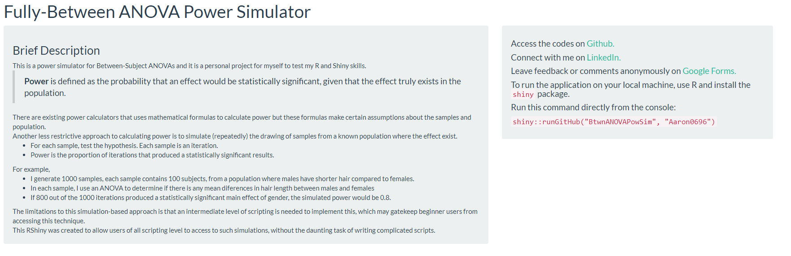
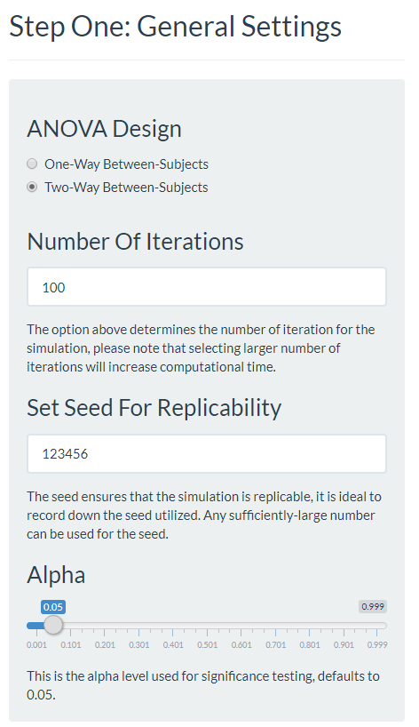

# BtwnANOVAPowSim
### Between-subjects ANOVA Power Simulator
> Implementing a simulation-approach to calculating power in R Shiny.

## Introduction
This is a personal project to consoliate and apply my knowledge in making R Shiny apps. The app provides a *user-friendly* platform for users to simulate power while adjusting various parameters that are usually constrained by assumptions when using formulas.

* For example, users can select different variances for each condition, whereas typical power calculation assumes that variances are similar across conditions.
* Users can also allow different groups to have different sample sizes to ascertain the effect of unequal group sizes.

The app has two purpose:

* **Education**: Users can play and experiment with the different combination of parameters, noting their effect on the simulated power.
* **Research**: Users can input the expected population values and expected sample sizes to obtain a simulated power to guide their research design. Population values can be derived from existing studies, meta-analysis or even expert knowledge/experience.

...while allowing users to easily run simulations without extensive scripting knowledge and experiencing much pain in the process.

The current version of the app focuses on one-way and two-way between-subjects ANOVA as these are common analysis methods amongst Psychology undergraduates. Depending on feedback, I may consider extending them to other analysis methods.

## Power
> The probability that an effect would be statistically significant *in the collected sample* if the effect truly exists in the *population*.

Power is a concept that was taught in my first statistical course in Psychology. However, I felt that it did not receive its deserved attention during my undergraduate and graduate years in NUS. Few would conduct apriori power analysis while some might occasionally conduct post-hoc power analysis to justify why their experiment did not produce statistically significant results. This was probably what motivated me to learn more about power in the first place.

There are a large number of resources which talk about power, its importance and determinants so I will not elaborate much on it here.

## Launch App

There are two ways to launch the app.

### Browser

The app is uploaded onto the free server provided by `shinyapps.io` and can be accessed from the link below.

https://aaron0696.shinyapps.io/BtwnANOVAPowSim/

### RStudio

The `shiny` package and github are integrated, such that users can run the app by using the following command after installing the `shiny` package.

```{r}
shiny::runGitHub("BtwnANOVAPowSim", "Aaron0696")
```

The title and description of the app should appear:



## Step One: General Settings

Further down the app are settings that require the user's input. We begin with the **General Settings** on the left.

There are four options here for the users to select.



### ANOVA Design

Select whether the design contains one or two independent variables, selecting two independent variables automatically includes the interaction effect in additon to the main effects.

### Number Of Iterations

This determines the number of samples to draw from the population, which we will define later. Larger number of iterations is always preferred but the drawback is that more computing resources would be required.

For education and tinkering purposes, 100 iterations is good. For more serious computations, such as simulating power for actual research purposes, at least 5000 iterations is recommended. It is recommended to run the app via RStudio instead of the browser for more intense computations.

### Seed

As we are randomly drawing samples from a population, we may get different results each time. Setting a seed ensures that your simulation is replicable across machines and instances as long as the same seed is set. There is not much need to change the seed but the option is there for users.

### Alpha

This is the alpha value used for significance testing, defaults to 0.05 as per convention.

## Step Two: Condition Parameters

The next step is inputting the **population parameters** for the simulation. 


### Selecting Number Of Levels 

Use the slider to select the number of levels that each of the independent variable contains. For a 2 x 3 ANOVA, this would be two for the first independent variable and 3 for the second independent variable.

Next, you get to name the levels in the panels below. These panels are reactive, the number of panels are equal to the number of levels selected in the previous step.

As an example, imagine that I am conducting an experiment where the first independent variable is **Attention** with two levels, the first level is *undivided attention* while the second level is *divided attention*. The second independent variable is **Difficulty** (of the task) with three levels: *Easy*, *Medium* and *Hard*.


Scroll further down to the next section in the app.

### Input Means, SD And Size

The user should see a series of panels:


Notice that the name in the panel corresponds to the user input. These panels are reactive, their titles would reflect the names that were selected above. The number of panels are also equal to the product of the number of levels of the first and second independent variable.

For each panel, input what you think the population mean and standard deviation is for the chosen condition. Also input the expected sample size for each condition that you plan to collect. Imagine my dependent variable was reaction time, measured in milliseconds. My fictional literature review suggested that the values for these conditions are as such, I also intend to collect 50 subjects per condition for a respectable total sample size of 300:


## Step Three: Run

The `run` button is on the right of the app, which will begin the simulation when pressed. The output will appear further down.


## Output

The output may take awhile to load but it should look like this:


On the left is the simulated power, presented in a table. Each row corresponds to one effect, for the 2 x 3 ANOVA, there are three effects, the main effect of Attention and Difficulty, and the interaction effect between the two.

We can see that we have fairly good power for each of the effects, hovering around *0.8*.

The graph is a visual representation of the population means for each condition, allowing users to doublecheck if they have imputted the intended values correctly.

Just for fun, imagine I want to be lazy and only collect half the intended sample. I half the condition sizes to 25 each and compare the drop in power. Notice that the power drops substantially for all effects and I might want to think twice about collecting less.


## Limitations and Future Directions

Some limitations and future directions for improving this app but not implemented due to constraints on my end. But do give feedback if you think that certain prospects will be useful or interesting! I created a google forms for anonymized feedback at https://forms.gle/DtFMw23xbA8Y8n4E9, where you can share your bugs, opinions or suggestions for the app!

* Extension to include power simulation for post-hoc tests.
* Extension to include repeated measures ANOVA, mixed ANOVA, regression and other analysis.
* Extension to include three-way designs.
* Allowing more parameters to be manipulated, such as skewness and kurtosis.
